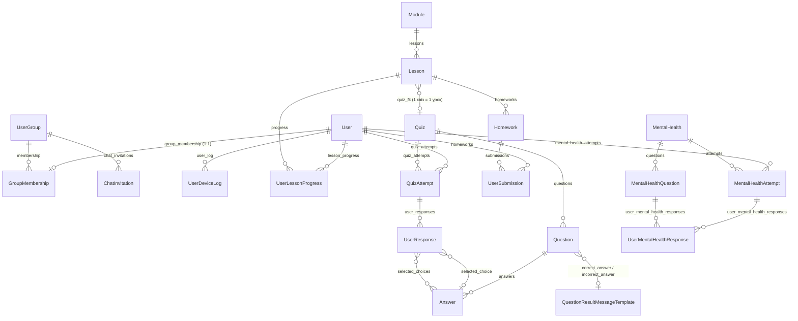

# Learning Platform (learning-platform-backend) — Концепція проєкту

> Цей документ — повний "blueprint" бекенду платформи. Орієнтуючись на нього, можна побудувати аналогічний проєкт з нуля: тут описані всі сутності, зв'язки, бізнес-правила, API, інфраструктура та вимоги.

---

## 1. Призначення та загальна ідея

**Learning Platform** — бекенд освітньої платформи з ментального здоров'я (онлайн-курс). Користувачі реєструються, потрапляють у **когорту (групу)**, проходять курс, що складається з **модулів** та **уроків** різних типів (текст, відео, аудіо, квіз, домашнє завдання). Модулі відкриваються поступово за **drip-розкладом** групи, уроки проходяться **строго послідовно**. За проходження нараховуються **бали (score)**. До початку та після завершення курсу користувач проходить **тест ментального здоров'я** (само-оцінювання), що дозволяє виміряти ефект курсу. Учасники отримують **запрошення в чати** (за віковою групою + загальний чат).

Ключові принципи:
- **API-first**: жодного фронтенду — лише REST API (Django Ninja) + адмін-панель для контент-менеджерів.
- **Когортна модель навчання**: контент відкривається групі за розкладом, а не індивідуально.
- **Гейміфікація**: бали за уроки та квізи, прогрес у відсотках (current/total score).
- **Вимірюваність результату**: тест "до/після" з однаковими питаннями.

---

## 2. Технологічний стек

| Шар | Технологія |
|---|---|
| Мова | Python ≥ 3.13.7 (менеджер пакетів — `uv`) |
| Фреймворк | Django 5.2 |
| API | Django Ninja (`django-ninja` ≥ 1.4.3) + `django-ninja-jwt` (JWT) + `ninja-extra` (статуси) |
| БД | PostgreSQL 17 (`psycopg2-binary`; `ArrayField` з `django.contrib.postgres`) |
| Кеш | Redis 7 (`django-redis`) |
| Файли | DigitalOcean Spaces (S3-сумісне, `django-storages` + `boto3`); локально — файлова система |
| Адмінка | `django-unfold` (тема), `django-tinymce` (WYSIWYG-редактор HTML-контенту) |
| Телефони | `django-phonenumber-field` + `phonenumbers` |
| Email | SMTP / SendGrid (`django-sendgrid-v5`), HTML-шаблони |
| Логування | `loguru` + InterceptHandler для стандартного `logging`, request-id у контексті |
| Моніторинг | Sentry (`sentry-sdk` з Django- та Loguru-інтеграціями) |
| Аналітика пристроїв | `user-agents` (парсинг User-Agent) |
| Тести | `pytest`, `pytest-django`, `pytest-cov` (поріг покриття **80%**) |
| Лінтер | `ruff` (line-length 120, isort через `extend-select = ["I"]`) |
| Версіонування | `commitizen` (конвенція `type(JIRA-ID): message`) |
| Деплой | Docker + docker-compose (db, redis, web, nginx), gunicorn, GitHub Actions (CI/CD по SSH) |
| i18n | `uk` (основна), `en`; `LocaleMiddleware`, `i18n_patterns` для адмінки, gettext |

---

## 3. Структура проєкту

```
.
├── config/                  # Django-проєкт
│   ├── settings.py          # єдиний settings, конфіг через .env (python-dotenv)
│   ├── urls.py              # NinjaAPI + підключення роутерів і exception handlers
│   ├── middleware.py        # RequestIDMiddleware, DeviceLogMiddleware
│   ├── logging.py           # loguru: InterceptHandler, файловий лог з ротацією
│   ├── storages.py          # S3-класи StaticStorage / MediaPublicStorage
│   ├── throttles.py         # LoggingAuthRateThrottle (діагностичний)
│   ├── asgi.py / wsgi.py
├── apps/
│   ├── routers.py           # API_ROUTERS: список (префікс, router) для всіх застосунків
│   ├── translations.py      # рядки unfold для gettext
│   ├── users/               # користувачі, групи, чат-запрошення, девайс-логи
│   ├── modules/             # модулі, уроки, прогрес уроків
│   ├── quizzes/             # квізи, питання, відповіді, спроби
│   ├── homeworks/           # домашні завдання, здачі
│   ├── mental_health/       # тест ментального здоров'я (до/після)
│   └── admin_custom/        # службові admin-ендпоїнти (drag&drop порядок, аплоад файлів)
├── mixins/                  # спільний код: AppException, exception handlers,
│   │                        # SingletonModel, базові схеми (ErrorSchema, MessageSchema)
├── templates/
│   ├── emails/              # activation_email.html, password_reset_email.html,
│   │                        # chat_invitation_email.html
│   └── admin/base_site.html
├── static/                  # логотипи, css/js адмінки (drag-and-drop.js, text_editor.js …)
├── locale/                  # переклади uk/en
├── nginx/site.conf
├── docker-compose.yaml / docker-compose.dev.yaml / Dockerfile / entrypoint.sh
├── Makefile                 # build, upd, migrate, migrations, superuser, tests, collectstatic
└── pyproject.toml
```

Кожен застосунок має однакову внутрішню структуру: `models.py`, `api.py` (Ninja Router), `schemas.py` (Pydantic/Ninja схеми), `exceptions.py`, `admin.py`, `forms.py`, `services.py`/`utils.py` (бізнес-логіка), `signals.py`, `tests.py`.

---

## 4. Доменна модель

### 4.1 ER-діаграма



### 4.2 `apps.users`

#### `User` (AbstractUser, `AUTH_USER_MODEL = "users.User"`)
Email — унікальний ідентифікатор (`USERNAME_FIELD = "email"`), `username` дублює email. Кастомний `UserManager` (`create_user` / `create_superuser` за email). У `save()` — автохешування пароля, якщо він ще не захешований (перевірка префіксу `pbkdf2`).

| Поле | Тип | Примітка |
|---|---|---|
| first_name, last_name | CharField(150) | обов'язкові |
| email | EmailField | unique |
| phone | PhoneNumberField | unique, нормалізація в E164 (дефолтний регіон **SE**) |
| score | PositiveIntegerField | поточні бали, default 0, перераховується сервісом |
| gender | choices `GenderChoice` | female / male / non_binary / prefer_not_to_say; nullable |
| age_group | choices `AgeGroupChoice` | **under_24 / 25_44 / 45_plus**; обов'язкове, default under_24 |
| country, city | CharField | обов'язкові |
| children | choices `ChildrenChoice` | yes_under_5 / yes_6_18 / yes_18_plus / no / prefer_not_to_say; nullable |
| family_status | choices `FamilyStatusChoice` | in_relationship_or_married / not_in_relationship / divorcing_or_divorced / prefer_not_to_say; nullable |
| interests | ArrayField(CharField choices `InterestTypeChoice`) | mental_health, relationships, parenting, self_development, career, creativity, physical_health, spirituality, hobbies, prefer_not_to_say |
| interests_other | CharField(255) | вільний текст |
| has_approved_requirements | BooleanField | **гейт доступу до всього контенту** (згода з умовами) |
| date_joined | DateTimeField auto_now_add | |
| is_active | (успадковане) | false до активації email; "видалення акаунта" = is_active=False |

#### `UserGroup` (когорта)
| Поле | Тип | Примітка |
|---|---|---|
| uuid | UUIDField | unique, db_index |
| users | M2M до User через `GroupMembership` | |
| label | CharField(255) | внутрішня назва |
| is_active | BooleanField | реєстрація відкрита саме в активну групу |
| registration_started_at / registration_finished_at | DateTimeField | вікно реєстрації |
| course_started_at | DateTimeField | старт курсу когорти |
| opening_interval_days | PositiveIntegerField, default 7 | інтервал відкриття модулів |

Валідація (`clean`): кінець реєстрації пізніше за початок; завжди має існувати хоча б одна активна група; активна група мусить мати майбутню `registration_finished_at`.

Методи drip-розкладу:
- `get_module_unlock_date(module_order)` → `course_started_at + (order − 1) × opening_interval_days` (модуль №1 — у день старту).
- `is_module_available(module_order)` → `now() >= unlock_date`.

#### `GroupMembership`
`group` FK → UserGroup, `user` **OneToOne** → User (користувач може бути лише в одній групі), `date_joined` auto.

#### `ChatInvitation`
Запрошення в месенджер-чати. Поля: `group` (FK, nullable), `audience` (choices: `general` + усі значення `AgeGroupChoice`), `chat_title`, `invite_link` (URL), `custom_invite_message`, `is_active`, created/updated. Обмеження:
- `UniqueConstraint(group, audience)` — одна авдиторія на групу;
- вікові чати обов'язково прив'язані до групи;
- глобальний (без групи) `general`-чат може існувати лише один.

#### `UserDeviceLog`
Журнал пристроїв: `user_fk` (nullable FK), `ip_address`, `os_name`, `browser`, `device_type` (mobile/tablet/pc/bot/unknown), `raw_user_agent`, `created_at`. Заповнюється middleware (див. §8.2), readonly в адмінці.

### 4.3 `apps.modules`

#### `Module`
`name`, `description` (HTMLField/TinyMCE), `order` (авто: max+1 при створенні), `is_scored` (чи враховується в балах), `is_active`. Менеджери: `objects` та `active = ActiveManager()` (фільтр `is_active=True`). Ordering за `order`.

#### `Lesson`
| Поле | Тип | Примітка |
|---|---|---|
| name | CharField(120) | |
| module_fk | FK → Module (CASCADE), related_name `lessons` | |
| content_type | choices `ContentType` | **text / video / audio / quiz / homework** |
| quiz_fk | FK → Quiz, nullable, `limit_choices_to={"lessons__isnull": True}` | квіз можна прив'язати лише до одного уроку |
| video_url | FileField → `videos/` | дозволено mp4, webm, mov |
| audio_url | FileField → `audio/` | дозволено mp3, m4a, wav, ogg |
| description | HTMLField | лише для video/audio (інакше обнуляється в `save`) |
| text_content | HTMLField | контент для text-уроку |
| score | FloatField | **виставляється автоматично в `save()`**: text=2, audio=2, video=3, quiz/homework=0 (мають власний скоринг) |
| order | PositiveIntegerField | авто max+1 |
| is_active | BooleanField | |

Менеджери: `objects`, `active = ActiveLessonManager()` — `is_active=True AND module_fk.is_active=True`.

Валідація в адмінці (`LessonAdminForm`): залежно від `content_type` обов'язкове відповідне поле (text → text_content, video → video_url, audio → audio_url, quiz → quiz_fk, homework → інлайн Homework через `HomeworkInlineFormSet`); нерелевантні контент-поля очищуються.

#### `UserLessonProgress`
`user_fk` FK → User, `lesson_fk` FK → Lesson, `is_completed`, `completed_at` (auto_now_add). `UniqueConstraint(user_fk, lesson_fk)`. Property `user_score` → `user_fk.score`.

### 4.4 `apps.quizzes`

#### `Quiz`
`name`, `description` (HTML). Property `max_score`: сума по питаннях — TEXT-питання = 2.0, інші = 1.0.

#### `QuestionResultMessageTemplate`
Шаблони повідомлень-фідбеку: `message` (text), `is_correct` (bool). Перевикористовуються між питаннями.

#### `Question`
`title`, `question_type` (choices `QuestionTypes`: **text / multiple / single**), `order` (авто max+1), `quiz_fk` FK → Quiz, `correct_answer` / `incorrect_answer` — FK на `QuestionResultMessageTemplate` (з `limit_choices_to` по `is_correct`), nullable.

#### `Answer` (варіант відповіді)
`response` (CharField 120), `is_correct`, `order` (авто), `question_fk` FK → Question. Валідація формсету в адмінці: у SINGLE_CHOICE рівно одна правильна; у не-TEXT — мінімум одна правильна.

#### `QuizAttempt`
`uid` (UUID, unique), `user_fk`, `quiz_fk`, `lesson_context` (FK → Lesson, SET_NULL — у рамках якого уроку проходився), `score` (Float), `started_at` / `finished_at`, `is_completed`, `is_force_completed`.
- `missing_questions` → множина id питань без відповіді;
- `can_be_finished` → всі питання відповіли;
- `finish()` → завершує і рахує `score = Σ points_awarded`;
- `force_finish()` → завершує без суми (примусово, ставить `is_force_completed`).

#### `UserResponse`
`attempt_fk` FK → QuizAttempt, `question_fk` FK → Question, `text_response` (для TEXT), `selected_choice` (FK Answer, для SINGLE), `selected_choices` (M2M Answer, для MULTIPLE), `is_correct`, `points_awarded`. `UniqueConstraint(attempt_fk, question_fk)` — одна відповідь на питання за спробу.

### 4.5 `apps.homeworks`

#### `Homework`
`name`, `description` (HTML), `lesson_fk` FK → Lesson (related_name `homeworks`), `is_auto_approved` (default True). В адмінці — StackedInline в уроці, максимум 1 на урок.

#### `UserSubmission`
`user_fk`, `homework_fk`, `text_answer` (Text, nullable), `file_answer` (FileField, дозволено **pdf/docx/txt**, шлях `homeworks/hw_{homework_id}/user_{user_id}/{uuid}.{ext}`), `feedback` (відгук ревʼюера), `is_approved`, `created_at`, `date_review`, `updated_at`. `UniqueConstraint(user_fk, homework_fk)` — одна здача на користувача.

Логіка `save()`: якщо змінилися `feedback`/`is_approved` — проставляється `date_review = now()`; якщо `homework.is_auto_approved` — `is_approved = True` автоматично. `clean()`: обов'язковий текст АБО файл.

### 4.6 `apps.mental_health`

#### `MentalHealth` (SingletonModel)
Єдиний у системі тест: `title`, `additional_content` (HTML). Доступ через `MentalHealth.get_solo()` (кеш у Redis за ім'ям класу, інвалідація при save/delete).

#### `MentalHealthQuestion`
`question` (text), `min_score` (default 0), `max_score` (default 5) — шкала відповіді (Likert), `order` (авто), `mental_health` FK (автопідставляється singleton при створенні).

#### `MentalHealthAttempt`
`number` — IntegerChoices `MentalHealthAttemptNumber`: **1 = BEFORE_START (до навчання), 2 = AFTER_FINISH (після)**; `score` (сума відповідей), `created_at`, `user_fk`, `mental_health` FK. `UniqueConstraint(user_fk, number)` — по одній спробі кожного типу.

#### `UserMentalHealthResponse`
`attempt_fk`, `question_fk`, `response` (PositiveInteger), `created_at`.

### 4.7 `mixins` (спільний шар)

- **`SingletonModel`** (abstract): `save()` видаляє всі інші записи; `get_solo()` з кешуванням; `load()` повертає інстанс або порожній обʼєкт.
- **`AppException`**: базовий виняток з `message` (i18n) і `status_code` (default 500). Усі доменні винятки успадковуються від нього.
- **`ErrorSchema`** (`{"error": str}`) і **`MessageSchema`** (`{"detail": str}`) — стандартні обгортки відповідей.
- **`handlers.py`**: глобальні exception handlers для NinjaAPI (див. §7).

---

## 5. Бізнес-правила (ядро системи)

### 5.1 Життєвий цикл користувача
1. **Реєстрація** (`POST /api/users/register`): валідація пароля Django-валідаторами, телефону через `phonenumbers`; перевірка унікальності email/phone → 409. Користувач створюється з `is_active=False`.
2. **Сигнал** `post_save(User, created=True)` → автоматичне зарахування в найстаршу активну `UserGroup` (через `GroupMembership`). Якщо активної групи немає — користувач без групи.
3. На пошту летить **лист активації** (посилання `{frontend}/activate/{uidb64}-{token}`, токен — `default_token_generator`). Надсилання — у фоновому `threading.Thread`.
4. **Активація** (`POST /api/users/activate`) → `is_active=True` + автоматичний **лист із запрошеннями в чати** (персональний за віковою групою + загальний).
5. **Логін** (`POST /api/users/login`) → пара JWT (access 15 хв / refresh 30 днів, ротація refresh). Неактивний користувач — 403.
6. Користувач підтверджує умови (`PATCH /api/users/me` з `has_approved_requirements=true`). **Без цього прапорця всі контент-ендпоїнти повертають 403** (`__check_has_user_approved_requirements`).
7. **Відновлення пароля**: forgot-password (без розкриття існування email) → лист `{frontend}/reset-password/{uidb64}-{token}` (TTL 1 год, `PASSWORD_RESET_TIMEOUT`) → reset-password з підтвердженням пароля.
8. **Видалення акаунта** = soft-delete (`is_active=False`).

### 5.2 Доступ до контенту (drip + послідовність)
- **Доступ до модуля** (`__check_module_access`): користувач мусить мати групу (інакше 403 "не member of any group"); модуль доступний, якщо `now() >= group.get_module_unlock_date(module.order)`. Інакше — `ModuleClosedError` (403) із датою відкриття `opening_date` у відповіді.
- **Доступ до уроку** (`__check_lesson_access`): крім доступу до модуля — **строга послідовність**:
  - якщо користувач ще нічого не пройшов — доступний лише найперший урок першого активного модуля (інакше `EducationNotStartedError`);
  - пройдені уроки завжди доступні повторно;
  - наступним можна відкрити лише урок, що йде безпосередньо за останнім завершеним (з переходом між модулями); інакше `PreviousLessonNotCompletedError`.
- Порядок уроків глобально визначається кортежем `(module.order, lesson.order, lesson.id)`.

### 5.3 Скоринг
- **Бали за уроки** (виставляються автоматично у `Lesson.save()`): text = 2, audio = 2, video = 3, quiz = 0, homework = 0.
- **Бали за квіз** (нараховуються за відповіді):
  - TEXT-питання: будь-яка відповідь = 2 бали, завжди `is_correct=True` (рефлексивні питання);
  - SINGLE_CHOICE: правильний вибір = 1 бал;
  - MULTIPLE_CHOICE: частковий бал `max(0, (правильні_вибрані − неправильні_вибрані) / всього_правильних) × 1`; `is_correct`, лише якщо ratio = 1.0.
- **Сумарний рахунок користувача** — `UserProgressService.recalculate_user_score(user)`:
  - Σ `lesson.score` завершених уроків (лише активні уроки активних модулів з `is_scored=True`, без quiz/homework-уроків)
  - + Σ по кожному квізу **максимального** `score` серед завершених спроб (best attempt).
  - Записується в `user.score`. Викликається при завершенні квізу та сигналами при зміні прогресу/активності уроків і модулів.
- **Максимально можливий бал** — `get_total_possible_score()`: Σ score активних уроків + по всіх квізах активних уроків (TEXT-питання × 2 + інші × 1).
- **Поточна позиція** — перший незавершений активний урок (модуль + урок) у глобальному порядку.

### 5.4 Квіз-флоу
1. `POST /api/quizzes/attempts` — старт спроби в контексті уроку (`quiz_id` + `lesson_id`). Якщо в користувача вже є незавершена спроба цього квізу — 400 з `uid` наявної спроби (продовжити можна її).
2. `POST /api/quizzes/attempts/answers` — відповідь на питання (text / answer_ids). Повторна відповідь на те саме питання — 409 (`AnswerAlreadyExistError`). У відповіді — нараховані бали, правильні варіанти та повідомлення-фідбек (correct/incorrect message з шаблонів).
3. `POST /api/quizzes/attempts/results` — завершення. Якщо `is_force=false` і відповіли не на всі питання — 400; `is_force=true` дозволяє примусове завершення. Після завершення — перерахунок балів користувача.
4. Кількість спроб не обмежена; у залік іде найкраща.

### 5.5 Домашні завдання
- Здача (`POST /api/homeworks/submission`, multipart): текст та/або файл — обов'язково хоч щось (422). Повторна здача — 409; редагування — через `PUT`.
- Якщо `is_auto_approved` — апрув автоматично; інакше ревʼюер в адмінці виставляє `feedback`/`is_approved` (дата ревʼю фіксується автоматично).

### 5.6 Тест ментального здоров'я
- Один тест на систему (singleton) з упорядкованими питаннями та шкалою min/max на питання.
- Спроба №1 (BEFORE_START) — доступна одразу (після згоди з умовами).
- Спроба №2 (AFTER_FINISH) — лише якщо: (а) існує перша спроба (інакше 403 `NoPreviousAnswerException`), (б) користувач завершив останній урок курсу — перевірка `UserLessonProgress` по уроку з максимальним `order` (інакше 403 `NotCompletedEducationException`).
- Відповіді створюються bulk; `score = Σ response`. Сигнал на зміну/видалення відповіді перераховує score спроби.
- Дублювання спроби блокується унікальним обмеженням `(user, number)` → глобальний handler IntegrityError → 409.

### 5.7 Чат-запрошення
- Персональний чат: `ChatInvitation` групи користувача з `audience == user.age_group`.
- Загальний чат: `audience == "general"` групи; fallback — глобальний general-чат без групи.
- Доставка: лист після активації + ендпоїнт `GET /api/users/me/chats`.

---

## 6. REST API

Усе під префіксом `/api/`. Документація — `/api/docs` (лише для staff: `docs_decorator=staff_member_required`). Авторизація — `JWTAuth` (Bearer), якщо не вказано інше. Анонімні ендпоїнти захищені `AnonRateThrottle`.

### `/api/users/` (tag: Users)
| Метод | Шлях | Auth | Throttle | Опис / відповіді |
|---|---|---|---|---|
| POST | `/register` | — | 5/m | 201 UserResponse; 409 email/phone зайняті |
| POST | `/activate` | — | 5/m | {uid, token}; 200; 400 невалідний токен / вже активний |
| POST | `/login` | — | 10/m | 200 {access, refresh}; 400 невірні дані; 403 неактивний; 404 немає юзера |
| POST | `/refresh` | — | 10/m | ротація refresh-токена |
| GET | `/me` | JWT | | профіль (із групами) |
| PATCH | `/me` | JWT | | оновлення профілю / зміна пароля (old+new+confirm); 409 телефон зайнятий |
| DELETE | `/me` | JWT | | soft-delete (is_active=False) |
| GET | `/me/progress` | JWT | | {current_score, total_score, current_module, current_lesson} |
| GET | `/me/lessons/progress` | JWT | | список {lesson_id, is_completed} |
| GET | `/me/chats` | JWT | | {personal_chat, general_chat} |
| POST | `/forgot-password` | — | 3/m | завжди 200 (без розкриття) |
| POST | `/reset-password` | — | 5/m | {uid, token, new_password, new_password_confirm} |

### `/api/modules/` (tag: Modules)
| Метод | Шлях | Опис |
|---|---|---|
| GET | `/` | усі активні модулі з уроками (короткі схеми) |
| GET | `/{module_id}` | модуль (перевірка drip-доступу) |
| GET | `/{module_id}/lessons` | уроки модуля (розширена схема: контент, quiz_id, homeworks) |
| GET | `/{module_id}/lessons/{lesson_id}` | урок + навігація previous/next (перевірка послідовності) |
| POST | `/lessons/complete` | {module_id, lesson_id} → створює/оновлює UserLessonProgress (атомарно), сигнал перераховує score |

Навігація уроку (`LessonNavigationService`): previous = попередній у глобальному порядку; next = наступний, **але** якщо позаду є незавершений урок — next вказує на нього (повертає користувача до пропущеного).

### `/api/quizzes/` (tag: Quizzes)
| Метод | Шлях | Опис |
|---|---|---|
| POST | `/attempts` | старт спроби {quiz_id, lesson_id} |
| POST | `/attempts/answers` | відповідь {attempt_uid, quiz_id, lesson_id, question_id, text_response?, answer_ids?} |
| POST | `/attempts/results` | завершення {attempt_uid, quiz_id, lesson_id, is_force} |
| GET | `/{module_id}` | квізи модуля (з питаннями та варіантами, max_score) |
| GET | `/{module_id}/{quiz_id}` | один квіз |
| GET | `/{module_id}/{quiz_id}/attempts` | спроби поточного користувача |

### `/api/homeworks/` (tag: Homeworks)
| Метод | Шлях | Опис |
|---|---|---|
| GET | `/{homework_id}` | завдання |
| GET | `/submission/{homework_id}` | моя здача |
| POST | `/submission` | multipart: homework_id + text_answer? + file_answer? |
| PUT | `/submission/{homework_id}` | редагування здачі |

### `/api/mental-health/` (tag: Mental Health)
| Метод | Шлях | Опис |
|---|---|---|
| GET | `/` | тест із питаннями |
| POST | `/answers` | {number: 1|2, answers: [{question_id, response}]} → створює спробу |
| GET | `/answers` | мої спроби з відповідями |

### `/api/admin/` (tag: Admin, auth: `StaffAuth` — сесія + is_staff, приховано зі схеми)
| Метод | Шлях | Опис |
|---|---|---|
| POST | `/save-order` | {app_label, model_name, orders: [{id, order}]} — bulk-збереження порядку після drag&drop в адмінці; **завжди HTTP 200** (помилка у тілі), щоб не світити коди в консолі |
| POST | `/upload-files` | аплоад файлу → {location: url} (для TinyMCE-зображень), ім'я файлу = uuid |

---

## 7. Обробка помилок (глобальні handlers NinjaAPI)

Реєструються в `config/urls.py` із `mixins/handlers.py` (порядок — від специфічного до загального):

| Виняток | Статус | Тіло |
|---|---|---|
| `AppException` (база доменних) | з винятку | `{"detail": message}` |
| `IntegrityError` | 409 | "Duplicate entry." |
| `ValidationError` (Django) | 422 | текст помилки |
| `ObjectDoesNotExist` | 404 | текст |
| `PermissionDenied` | 403 | текст |
| `UserHasNotApprovedRequirementsError` | 403 | message |
| `ModuleClosedError` | 403 | `{"detail": ..., "opening_date": datetime}` |
| `Exception` (fallback) | 500 | "An internal error occurred." |

Доменні винятки: users — EmailAlreadyExists(409), PhoneAlreadyExists(409), UserInvalidCredential(400), UserNotActive(403), InvalidActivationToken(400), InvalidPasswordResetToken(400), UserAlreadyActive(400), InvalidOldPassword(400), UserHasNotApprovedRequirements(403); modules — EducationNotStarted(403), PreviousLessonNotCompleted(403), ModuleClosed(403); quizzes — QuizAttemptNotCompleted(400), AnswerAlreadyExist(409), QuestionNotAnswered(400); homeworks — UserSubmissionAlreadyExist(409); mental_health — NoPreviousAnswer(403), NotCompletedEducation(403).

---

## 8. Інфраструктурні компоненти

### 8.1 `RequestIDMiddleware`
Бере `X-Request-ID` із заголовка або генерує uuid4; кладе в `logger.contextualize(request_id=...)` (loguru) і повертає в response-заголовку. Формат файлового лога містить request_id.

### 8.2 `DeviceLogMiddleware`
Для запитів під `/api/`: парсить User-Agent (`user_agents`), визначає IP (X-Forwarded-For → REMOTE_ADDR), user_id — декодуванням JWT із Authorization-заголовка (без помилки, якщо нема). Створює `UserDeviceLog`, дедуплікація через Redis-ключ `device_logged_{user_id}_{ip}_{md5(ua)}` з TTL 24 год.

### 8.3 Сигнали
| Сигнал | Дія |
|---|---|
| `post_save(User, created)` | зарахування в активну групу |
| `post_save/post_delete(UserLessonProgress)` | перерахунок score користувача |
| `post_delete(Module)` / `post_delete(Lesson)` | перенумерація `order` (1..N) у транзакції з `select_for_update` |
| `post_save(Lesson)` / `post_save(Module)` зі зміною `is_active` | перерахунок score всіх користувачів, що проходили цей урок/модуль |
| `post_save/post_delete(UserMentalHealthResponse)` | перерахунок score спроби тесту |

### 8.4 Email
Надсилання через `EmailMessage` (content_subtype="html") у фонових daemon-тредах. Шаблони: `templates/emails/{activation_email, password_reset_email, chat_invitation_email}.html`. Бекенд конфігурується env: console (dev) / SMTP / SendGrid.

### 8.5 Логування
`loguru` як єдиний sink: stdlib `logging` перехоплюється `InterceptHandler` (LOGGING → handlers.intercept). Вивід: stderr (INFO) + файл `app.log` (ротація 500 MB, retention 10 днів, zip, enqueue). Sentry-інтеграція через `LoguruIntegration` + `DjangoIntegration` (рівень конфігурується `SENTRY_LOGS_LEVEL`).

### 8.6 Кеш
Redis (`django_redis`), використовується для: singleton-кешу MentalHealth, дедуплікації девайс-логів, троттлінгу Ninja.

### 8.7 Файлове сховище
Якщо `USE_SPACES=1` і не DEBUG: DigitalOcean Spaces (S3) — `StaticStorage` (location="static") та `MediaPublicStorage` (location="media", public-read, без querystring auth, без перезапису). Інакше — локальні `staticfiles/` і `mediafiles/`.

---

## 9. Адмін-панель (django-unfold)

- Кастомна тема Unfold: логотипи light/dark, фавікон, перемикач мов, повна палітра кольорів (`UNFOLD` у settings); `templates/admin/base_site.html`.
- **TinyMCE** для всіх HTML-полів (description, text_content, additional_content) + аплоад зображень через `/api/admin/upload-files`.
- **Drag&drop сортування** (модулі, уроки, питання, питання мент-тесту): статичні `js/admin/drag-and-drop.js` + `css/admin/drag-and-drop.css`, збереження через `/api/admin/save-order`; поле `order` приховане з форм.
- **Динамічні форми**: `js/admin/lesson_toggle.js` (показ полів за content_type), `question_toggle.js`.
- **UserAdmin**: list_display з усією демографією, фільтри, пошук, лінк на групу; екшени: **Export to CSV** (з `get_*_display` людськими значеннями), кнопки в submit line — "Send activation email" (лише для неактивних) і "Send chat invitation email" (лише для активних) з permission-методами.
- **UserGroupAdmin**: інлайн учасників (autocomplete), лічильник користувачів.
- **UserLessonProgressAdmin**: за замовчуванням показує **останній завершений урок кожного користувача** (Subquery по OuterRef), клік по користувачу → повна історія (фільтр user_fk).
- **UserSubmissionAdmin**: тільки перегляд здач + редагування feedback/is_approved прямо в списку; додавання заборонене.
- **MentalHealthAdmin**: заборона створення другого запису (singleton).
- **QuizAttemptAdmin / MentalHealthAttemptAdmin**: інлайни відповідей readonly.
- **UserDeviceLogAdmin**: повністю readonly.
- Стандартна Django Group захована й перереєстрована під Unfold.
- Адмінка живе під i18n-префіксом: `/{lang}/admin/`.

---

## 10. Налаштування та змінні оточення (.env)

```
SECRET_KEY, DEBUG, ALLOWED_HOSTS, CSRF_TRUSTED_ORIGINS, CORS_ALLOW_ORIGIN, SITE_ID,
DJANGO_PORT, NGINX_PORT, NINJA_NUM_PROXIES,
SQL_ENGINE, POSTGRES_DB/USER/PASSWORD/HOST/PORT,
REDIS_HOST/PORT/DB/PASSWORD,
EMAIL_BACKEND/HOST/PORT/USE_TLS/USE_SSL/HOST_USER/HOST_PASSWORD, DEFAULT_FROM_EMAIL, SENDGRID_API_KEY,
USE_SPACES, AWS_ACCESS_KEY_ID/SECRET_ACCESS_KEY/STORAGE_BUCKET_NAME/REGION_NAME,
SENTRY_DSN/ENVIRONMENT/LOGS_LEVEL/TRACES_SAMPLE_RATE,
GUNICORN_WORKERS
```

Ключові константи: JWT access 15 хв / refresh 30 днів з ротацією; `PASSWORD_RESET_TIMEOUT=3600`; `LANGUAGE_CODE="uk"`, мови uk/en; `TIME_ZONE="Europe/Stockholm"`; `SECURE_PROXY_SSL_HEADER` для роботи за nginx.

---

## 11. Розгортання

- **Docker-композиція**: `db` (postgres:17.2) → `redis` (7-alpine) → `web` (Dockerfile: python:3.13.7, uv sync) → `nginx` (reverse proxy, віддає /static/ і /media/, gzip, client_max_body_size 50M).
- **entrypoint.sh** (prod): `migrate --noinput` → `collectstatic` → `compilemessages` → gunicorn (3 workers за замовчуванням).
- **docker-compose.dev.yaml**: замість gunicorn — `runserver` з автоміграцією.
- **Makefile**: `build / upd / migrate / migrations / superuser / tests / collectstatic` через compose.
- **CI (GitHub Actions, шаблон)**: ruff check + pytest із сервісом Postgres; **CD**: SSH-деплой (git reset --hard + docker compose up --build) на dev (develop) і prod (main).
- **pre-commit** + **commitizen**: коміти `type(JIRA-ID): message`, автоматичний CHANGELOG і теги `vX.Y.Z`.

---

## 12. Вимоги до аналогічної реалізації (чекліст)

### Функціональні
1. Реєстрація за email із розширеним демографічним профілем; активація через email; JWT-автентифікація з refresh-ротацією; відновлення пароля; soft-delete акаунта.
2. Когорти (групи) з вікном реєстрації, датою старту курсу та інтервалом відкриття модулів; автозарахування нових користувачів в активну когорту; інваріант "завжди є одна активна група".
3. Обов'язкова згода з умовами (`has_approved_requirements`) як гейт усього контенту.
4. Курс: модулі → уроки 5 типів; drip-відкриття модулів по когорті; строго послідовне проходження уроків; навігація previous/next з поверненням до пропущених.
5. Гейміфікація: фіксовані бали за типи уроків, квізи з трьома типами питань і частковим скорингом, best-attempt залік, прогрес current/total + поточна позиція.
6. Домашні завдання: текст/файл, одна здача, авто- або ручний апрув із фідбеком.
7. Тест ментального здоров'я "до/після" зі шкалою на питання, обмеженнями послідовності та підрахунком балів.
8. Чат-запрошення за віковими сегментами + загальний чат; доставка email-ом і через API.
9. Адмінка для контент-менеджера: WYSIWYG, drag&drop порядок, CSV-експорт, ручні email-екшени, перегляд прогресу і спроб.
10. Журнал пристроїв користувачів (UA/IP/OS/браузер) з дедуплікацією.

### Нефункціональні
1. Покриття тестами ≥ 80% (pytest, `--cov-fail-under=80`).
2. Інтернаціоналізація uk/en усіх повідомлень (gettext) включно з помилками API.
3. Rate limiting анонімних ендпоїнтів (3–10/хв).
4. Структуроване логування з request-id; Sentry для помилок і трейсингу.
5. Уся бізнес-валідація — і на рівні схем (Pydantic), і на рівні моделей (clean/constraints); унікальні обмеження в БД як остання лінія захисту.
6. Транзакційність критичних операцій (завершення уроку, збереження відповіді квізу, перенумерація order).
7. Конфігурація виключно через env; секрети поза репозиторієм.
8. Файли користувачів — з валідацією розширень та uuid-іменами (без шляхів, керованих користувачем).

---

## 13. Патерни проєктування

### 13.1 Архітектурний стиль
- **Модульний моноліт (Modular Monolith)**: один деплоймент, поділений на слабко зв'язані доменні модулі (`apps/users`, `apps/modules`, `apps/quizzes`, `apps/homeworks`, `apps/mental_health`) зі спільним ядром `mixins/`.
- **Багаторівнева (шарувата) архітектура (Layered Architecture)** у кожному модулі: представлення (`api.py`) → DTO (`schemas.py`) → бізнес-логіка (`services.py`/`utils.py`) → доступ до даних (`models.py`/`managers.py`). Залежності спрямовані лише "вниз".
- **MVT (Model–View–Template)** — базовий патерн Django; через API-first підхід вироджений у "Model–Router–Schema" (REST API без шаблонного фронтенду).

### 13.2 Патерни GoF
| Патерн | Локалізація | Роль |
|---|---|---|
| Singleton (Одинак) | `mixins/singleton.py`, модель `MentalHealth` | єдиний запис тесту: `save()` видаляє дублікати, `get_solo()` кешує екземпляр |
| Observer (Спостерігач) | `signals.py` у users / modules / mental_health | реакції на події: автозарахування в групу, перерахунок балів, перенумерація order |
| Factory Method (Фабричний метод) | `UserManager.create_user` / `create_superuser` | інкапсуляція створення User (нормалізація email, хешування пароля) |
| Adapter (Адаптер) | `InterceptHandler` у `config/logging.py` | перетворення записів stdlib `logging` у формат `loguru` |
| Chain of Responsibility (Ланцюжок обов'язків) | middleware-стек; список `exception_handlers` у `mixins/handlers.py` | послідовна обробка запиту/винятку першим відповідним обробником |
| Template Method (Шаблонний метод) | перевизначення `save()` (`Lesson`, `UserSubmission`), `clean()` (форми, формсети) | каркас алгоритму в базовому класі Django, кроки перевизначаються в підкласах |
| Strategy (Стратегія) | бекенди storage/email через settings; `calculate_score` за `question_type` | взаємозамінні алгоритми, що обираються конфігурацією або типом даних |

### 13.3 Корпоративні патерни (PoEAA, M. Fowler)
- **Active Record** — моделі Django поєднують дані, персистентність і доменні методи (`QuizAttempt.finish()`, `UserGroup.get_module_unlock_date()`).
- **Service Layer** — `UserProgressService`, `LessonNavigationService`: міжмодельні бізнес-операції винесені з API-шару.
- **Data Transfer Object (DTO)** — Ninja/Pydantic-схеми відокремлюють внутрішні моделі від контракту API.
- **Front Controller** — єдина точка входу `NinjaAPI` у `config/urls.py`.
- **Query Object** — кастомні менеджери `ActiveManager`, `ActiveLessonManager`.
- **Unit of Work** — `transaction.atomic` для критичних операцій.

### 13.4 Допоміжні ідіоми
**Mixin** (пакет `mixins/`), **Soft Delete** (`is_active=False` замість видалення), **Cache-Aside** (`get_solo()` + Redis, дедуплікація девайс-логів).

> Формулювання для тексту диплому: «Серверна частина реалізована як модульний моноліт із багаторівневою архітектурою: шари представлення (REST API), передачі даних (DTO-схеми), бізнес-логіки (сервісний шар) та доступу до даних (ORM за патерном Active Record) розділені в межах кожного доменного модуля. У реалізації застосовано низку патернів проєктування: породжувальні — Singleton, Factory Method; структурні — Adapter, Mixin; поведінкові — Observer, Strategy, Template Method, Chain of Responsibility; а також корпоративні патерни Service Layer, Front Controller, Data Transfer Object і Unit of Work.»
```
